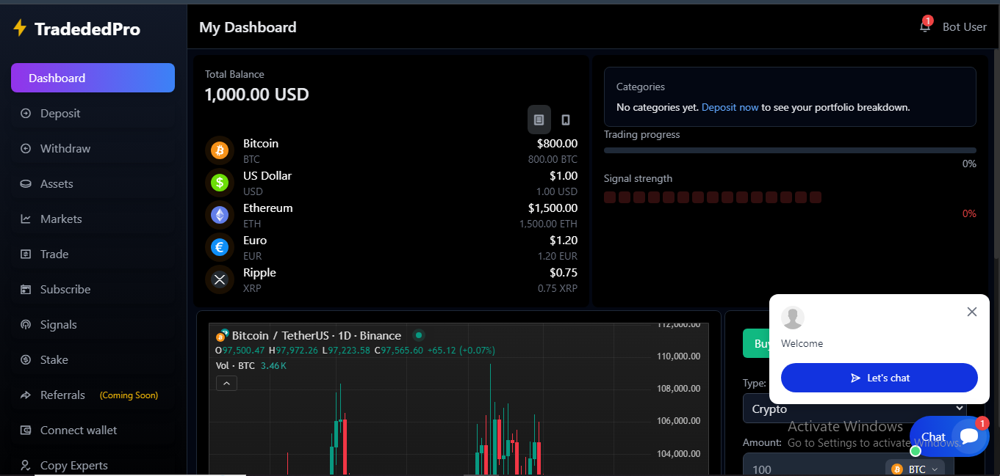

<p align="center"><a href="https://laravel.com" target="_blank"></a></p>
**
**
## Trading Platform

Welcome to the ojex Trading Platform project. This platform is designed to facilitate secure and efficient trading.

### Features

- Real-time market data
- Secure transactions
- User-friendly interface
- Advanced trading tools

### Screenshots

Here are some screenshots of the platform:


*Dashboard*


*Trading View*

### Installation

1. Clone the repository:
    ```bash
    git clone https://github.com/ktalib/ojex.git
    ```
2. Navigate to the project directory:
    ```bash
    cd trading-platform
    ```
3. Install dependencies:
    ```bash
    composer install
    npm install
    ```
4. Set up the environment file:
    ```bash
    cp .env.example .env
    php artisan key:generate
    ```
5. Run the migrations:
    ```bash
    php artisan migrate
    ```

### Usage

Start the development server:
```bash
php artisan serve
```
Visit `http://localhost:8000` in your browser to access the platform.

### Contributing

Feel free to submit issues or pull requests. For major changes, please open an issue first to discuss what you would like to change.

### License

This project is licensed under the MIT License.

### Contact

For more information, visit the [GitHub repository](https://github.com/ktalib/trading-platform).

 
